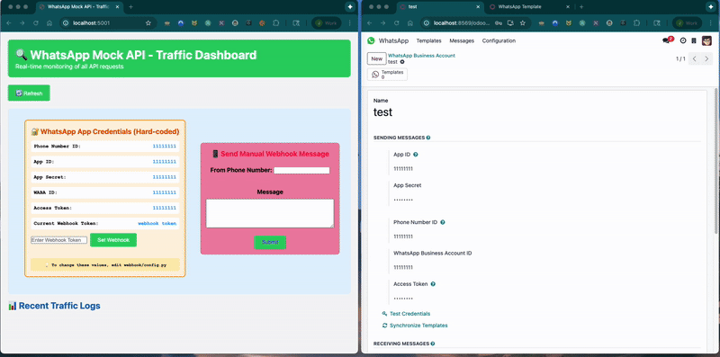

# Odoo WhatsApp Test Suite
This is to help Odoo Engineers debug WhatsApp integration because Facebook is tough to get and keep credentials for.
** This Project assumes the WhatsApp and Facebook data and responses are correct, and there is an issue inside Odoo. **

### Prerequisites

- Python 3.12.3
- VS Code with Python extension

## Setup

1. Start The Odoo WhatsApp Integration Test Suite
2. Inside Odoo source code, change the DEFAULT_ENDPOINT
   a. Find in Path - ./dev/src/enterprise/whatsapp
   b. file path /Users/josephmaiarana/odoo/universe/dev/src/enterprise/whatsapp/tools/whatsapp_api.py
   c. change "https://graph.facebook.com" to "http://localhost:5001"
3. Inside the database, install WhatsApp, Contacts, and any other Apps necessary
4) Go to WhatsApp> Configurations > WhatsApp Business Accounts > Set all the necessary fields to the fields displayed on the webpage. Currently everything is set to "11111111" but can be changed it configs/config.py
5) Click "Test Credentials" >  wait for it to return > Click "Sync Templates" * Templates are set with the template name, if the templates have conflicting names, it with give the "No duplicates (paraphrased)" Error. Just change the names in mock_data/message_templates.json

## Phone Numbers
- I have added some fake US numbers inside test-numbers.MD, please feel free to add more

## Mocked WhatsApp API Endpoints

The Flask app currently mocks these endpoints:
- `GET  /v<version>/<phone_number_id>/phone_numbers`
- `POST  /v<version>/<phone_number_id>/uploads`
- `POST & GET /v<version>/<phone_number_id>/message_templates `
- `POST /v{version}/{phone_number_id}/messages` - Send message endpoint
- Catch-all route for any unmocked endpoints (logs them for you to implement)

### Adding More Endpoints

When Odoo calls an endpoint that isn't mocked yet, you'll see it in the catch-all handler logs. To mock it:

1. Check the Flask terminal for the unmocked endpoint details
2. Add a new route in [main.py](main.py) matching that endpoint
3. Return appropriate mock data based on WhatsApp API documentation

### Docs
- https://developers.facebook.com/docs/whatsapp/
- https://business.whatsapp.com/developers/developer-hub

